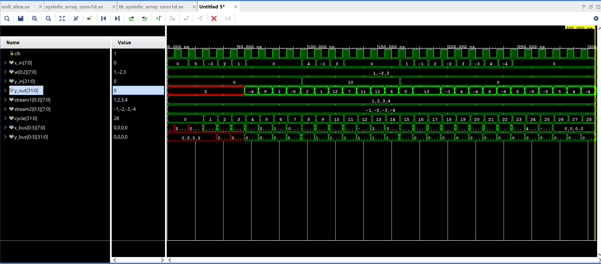

# Systolic Array for 1D Convolution in SystemVerilog

This project implements a parameterizable systolic array for 1D convolution-style multiply-accumulate operations in SystemVerilog. The design is built from reusable processing elements that pass input samples through a pipeline while accumulating weighted partial sums.

The goal was to explore the hardware datapath pattern used in convolution accelerators and TPU-style systolic arrays: local computation, regular data movement, and pipelined multiply-accumulate execution.

## Project Overview

The design maps a 1D convolution operation onto a chain of processing elements.

For an input sequence `x[n]` and weights `w[k]`, a 1D convolution can be written as:

```text
y[n] = Σ w[k] · x[n - k]
```

Instead of computing this with one large combinational block, the design breaks the operation into a pipeline. Each slice stores one weight, receives an input sample and partial sum, contributes one product, and forwards data to the next stage.

## Repository Structure

```text
.
├── systolic_array_conv1d.sv        # top-level systolic array module
├── unit_slice.sv                   # reusable processing element
├── tb_systolic_array_conv1d.sv     # SystemVerilog simulation testbench
├── systolic_model.py               # Python reference/timing model
├── tb_systolic_array_conv1d_behav.wcfg
└── waveform562lab3.png             # Vivado waveform screenshot
```

## Architecture

The array is organized as a linear chain of processing elements.

```text
        weight[0]      weight[1]      weight[2]
           ↓              ↓              ↓
x_in →  [slice 0]  →   [slice 1]  →   [slice 2]  → x_out
           ↓              ↓              ↓
        partial       partial        final sum
          sum           sum
```

Each processing element performs a registered multiply-accumulate step:

```text
x_out <= x_in
y_out <= y_in + x_in · weight
```

Because each slice is clocked, the result appears over several cycles rather than immediately. This makes pipeline timing, fill cycles, and flush cycles part of the design.

## Parameterization

The top-level module is parameterized so the same RTL can be reused with different array sizes and bit widths.

| Parameter | Meaning |
|---|---|
| `N` | number of processing elements / filter taps |
| `XW` | input and weight bit width |
| `YW` | accumulator/output bit width |

A typical test configuration uses:

```systemverilog
N  = 3;
XW = 8;
YW = 32;
```

The larger accumulator width helps preserve signed multiply-accumulate results without immediately overflowing.

## Dataflow

This is a weight-stationary systolic design:

- weights stay local to each processing element
- input samples move through the array
- partial sums move through the array
- each stage contributes one weighted term

This regular dataflow is useful in hardware because it reduces long global routing and turns repeated multiply-accumulate operations into a scalable pipeline.

## Verification

The testbench verifies the design with directed simulation cases covering:

- basic signed input streams
- positive and negative weights
- nonzero incoming partial sums
- pipeline fill and flush behavior
- interleaved input streams

A Python reference model, `systolic_model.py`, mirrors the cycle-level behavior of the array. This was used to reason about expected output timing and compare the hardware pipeline against a software model.

The included waveform screenshot shows signal propagation through the simulated design:

```markdown

```

## How to Run

### Vivado Simulation

Add these files to a Vivado project:

```text
unit_slice.sv
systolic_array_conv1d.sv
tb_systolic_array_conv1d.sv
```

Set the simulation top to:

```text
tb_systolic_array_conv1d
```

Then run behavioral simulation and inspect the waveform.

### Python Reference Model

Run:

```bash
python systolic_model.py
```

The Python model provides a reference for the expected cycle-by-cycle output behavior.
